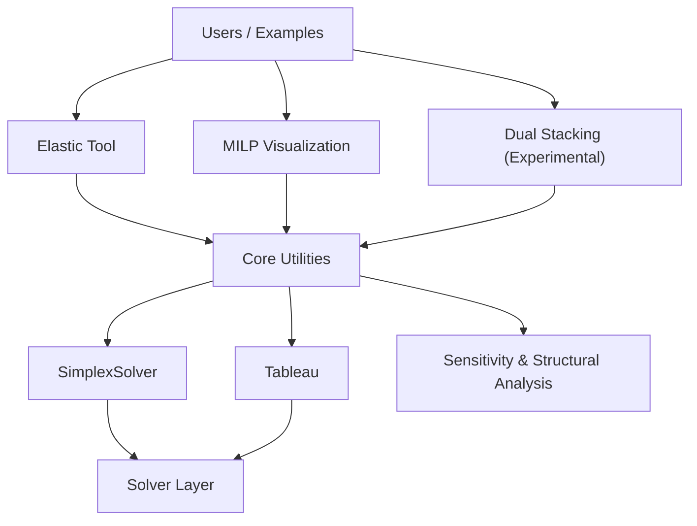

# Totsu

**Totsu** is a structural modeling and diagnostic toolkit for mathematical optimization.

Most optimization libraries focus on computing optimal solutions.
Totsu focuses on understanding *why* models behave the way they do.

It provides tools to measure structural tension, visualize combinatorial behavior, and explore negotiable trade-offs inside mathematical models.

---

## What Totsu Is

Totsu is not just a solver wrapper.

It is a toolkit for:

* Measuring infeasibility
* Diagnosing structural bottlenecks
* Visualizing MILP behavior
* Exploring trade-offs beyond a single optimal solution

Optimization is not only about deciding.
It is also about measuring.

---

# Core Capabilities

## 1. Elastic Tool — Structural Diagnosis

The Elastic Tool transforms infeasible or tightly constrained models into measurable systems.

Instead of failing with `infeasible`, it answers:

* Which constraints absorb the stress?
* How much relaxation is required?
* What is the structural cost of feasibility?

### Example

```
=== Structural Diagnosis Summary ===

Total violation cost: 100

Top structural tensions:
  - window_early[c2, day 1]: deviation=1.0, penalty=100, cost=100

Interpretation:
The model absorbs infeasibility primarily through delivery windows.
Are delivery windows constraints negotiable?
```

Elastic analysis makes constraint trade-offs visible.

---

## 2. MILP Structural Visualization

MILP models often suffer from combinatorial explosion.

Totsu provides tools to:

* Inspect branch-and-bound dynamics
* Understand degeneracy and pivot behavior
* Visualize constraint tightness
* Debug large-scale combinatorial structures

The goal is not only to solve MILPs faster —
but to understand why a formulation behaves the way it does.

---

## 3. Dual Stacking (Experimental)

Many real-world systems contain both stable structure and legitimate exceptions.

Dual Stacking explores a two-layer structural approach:

- A **stable layer** captures dominant, persistent structure.
- A **negotiable layer** captures conditional, context-dependent behavior.

The purpose is not to improve predictive accuracy.

The purpose is to separate:
- what is structurally fixed
- from what is structurally flexible

Rather than collapsing everything into a single model,
Dual Stacking preserves meaningful variation.

It aims to distinguish:
- core structure
- from structured exceptions
- without treating rare but valid cases as mere noise.

This direction builds on Elastic diagnosis and structural analysis,
and remains under experimental development.

---

## Architecture Overview


---

# Project Evolution

Totsu evolves in stages:

### Phase 1 — Elastic Diagnosis

Measure structural tensions by allowing controlled relaxations.

### Phase 2 — MILP Structural Visualization

Understand combinatorial explosion and model design quality.

### Phase 3 — Dual Stacking

Move from single optimal solutions toward structured trade-off landscapes.

---

# Installation

Totsu can be installed via Conda for robust dependency management.

```bash
conda install -c conda-forge pyomo numpy pytest plotly dash dash-bootstrap-components
pytest
```

For **Jupyter Notebook** support:
```bash
conda install jupyterlab
```

---

## When to Use Totsu

Use Totsu when you want to **understand model structure**, not only compute a solution.

### Good fit
- Your model becomes **infeasible**, and you want to know *which constraints are causing it* (Elastic Tool)
- A MILP “works” but is **slow / unstable / hard to explain**, and you want to see *why* (MILP Visualization)
- You need **interpretable trade-offs** and “negotiable constraints” rather than a single answer (Dual Stacking: experimental)

### Not a good fit
- You only need a fast optimal solution and already trust your formulation (use standard solvers directly)
- You don’t need diagnostics, explanation, or alternative trade-offs

---

# Examples

See:

```
totsu/examples/
```

For example:

```
python -m totsu.examples.assignments.demo_4ways_assignment_elastic_windows
```

---

# Philosophy

Optimization is not only about computing answers.
It is about making structure visible.

Totsu provides tools for structural measurement.

---

# Legacy / Advanced Modules

Detailed solver internals such as:

* SimplexSolver
* TableauVisualizer
* SensitivityAnalysis

are documented under:

```
totsu/utils/README.md
```

---

# License

Totsu is licensed under the [MIT License](LICENSE), ensuring it remains accessible and open for all.
