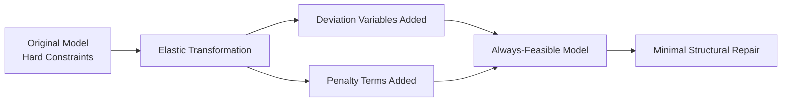
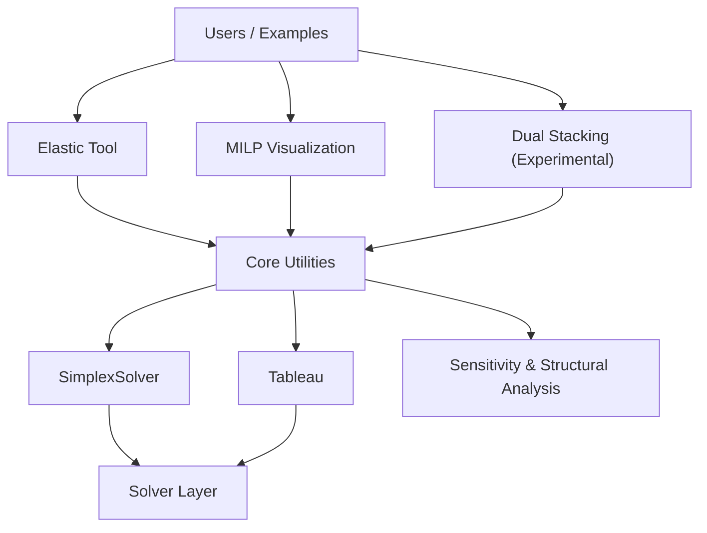

# Totsu

**Totsu** is a structural modeling and diagnostic toolkit for mathematical optimization.

Most optimization libraries focus on computing optimal solutions.
Totsu focuses on understanding *why* models behave the way they do.

It provides tools to measure structural tension, visualize combinatorial behavior, and explore negotiable trade-offs inside mathematical models.

---

## Try it in 3 minutes (Elastic feasibility repair)

Requires Pyomo + any LP/MILP solver available to Pyomo (HiGHS, CBC, or GLPK).

Check solver availability:

```bash
python -c "from pyomo.environ import SolverFactory; print('highs', SolverFactory('highs').available(False)); print('cbc', SolverFactory('cbc').available(False)); print('glpk', SolverFactory('glpk').available(False))"
```

If you already have a working **Pyomo + solver** environment, you can run Totsu from source without extra setup.

```bash
# Clone this repository
git clone git@github.com:ggsato/totsu.git
cd totsu

# Use auto solver detection (highs -> cbc -> glpk)
python -m totsu.examples.demo.transportation_elastic_quickstart --solver auto
```

What you should see:

* The base model is **infeasible**
* Elastic analysis reports the **minimal relaxations** needed to make it feasible
* This answers the practical request: **"Infeasible — what should we change to restore feasibility?"**

Next, try it on your own model:

```bash
python -m totsu.examples.demo.transportation_elastic_quickstart --help
```

> **Optional / Advanced — Gotcha: Penalty too small can make violations "cheap"**
> - What happens: if penalty is too small, the model may prefer violating constraints (e.g., demand effectively unmet / pushed to zero) instead of operating normally.
> - Why: the objective trades off business cost and violation penalty; a small penalty makes violation a cheap choice.
> - Fix:
>   - set penalties large enough for your model scale,
>   - start with `violation_only` to inspect violation amounts,
>   - then move to `original_plus_violation` for cost-aware repair.

For the public API path, see [docs/TRY_YOUR_MODEL.md](docs/TRY_YOUR_MODEL.md).

---

## What Totsu Is

Totsu is not just a solver wrapper.

It is a toolkit for:

* Measuring infeasibility
* Diagnosing structural bottlenecks
* Visualizing MILP behavior
* Exploring trade-offs beyond a single optimal solution

Optimization is not only about deciding.
It is also about measuring.

---

# Core Capabilities

## Elastic Tool — Structural Diagnosis

The Elastic Tool transforms infeasible or tightly constrained models into measurable systems.

Instead of stopping at `infeasible`, it answers:

### Elastic Structural Flow (Diagram)



* Which constraints absorb the structural stress?
* How much relaxation is required?
* What is the minimum structural adjustment needed?
* If relaxation is allowed, what is the most rational repair plan?

Elastic analysis supports two key modes:

---

### 🔸 Violation-Only Mode

Minimizes total constraint violation.

This answers:

> “How far is the model from feasibility?”

It measures structural deficit without considering the original objective.

---

### 🔸 Original + Violation Mode

Minimizes:

(original objective) + (penalty × violation)

This answers:

> “If limited relaxation is allowed, what is the most rational adjustment?”

This mode does not just measure infeasibility —  
it proposes a structurally minimal and economically consistent repair.

---

### Example — Transportation Model

Original model:
```
LP HAS NO PRIMAL FEASIBLE SOLUTION
```

Elastic (violation_only):
```
Total violation cost: 750
Supply constraints relaxed: +75 units
```

Elastic (original_plus_violation):
```
Relax 73 units at S3
Relax 2 units at S2
```

Note: in `original_plus_violation` mode, set violation penalties high enough
relative to normal objective coefficients. If penalties are too small, the model
can prefer violating demand/supply instead of performing real operations.

Interpretation:

The model requires 75 additional units of supply.  
Given transportation costs, the economically optimal repair is  
to expand Supplier S3 primarily.

Elastic analysis does not only diagnose infeasibility.  
It suggests how structure should adapt.

---

### A Higher Perspective

Optimization is not only about finding optimal answers.  
It is also about understanding how systems bend before they break.

---

## 2. MILP Structural Visualization

MILP models often suffer from combinatorial explosion.

Totsu provides tools to:

* Inspect branch-and-bound dynamics
* Understand degeneracy and pivot behavior
* Visualize constraint tightness
* Debug large-scale combinatorial structures

The goal is not only to solve MILPs faster —
but to understand why a formulation behaves the way it does.

---

## 3. Dual Stacking (Experimental)

Many real-world systems contain both stable structure and legitimate exceptions.

Dual Stacking explores a two-layer structural approach:

- A **stable layer** captures dominant, persistent structure.
- A **negotiable layer** captures conditional, context-dependent behavior.

The purpose is not to improve predictive accuracy.

The purpose is to separate:
- what is structurally fixed
- from what is structurally flexible

Rather than collapsing everything into a single model,
Dual Stacking preserves meaningful variation.

It aims to distinguish:
- core structure
- from structured exceptions
- without treating rare but valid cases as mere noise.

This direction builds on Elastic diagnosis and structural analysis,
and remains under experimental development.

---

## Architecture Overview


---

# Project Evolution

Totsu evolves in stages:

### Phase 1 — Elastic Diagnosis

Measure structural tensions by allowing controlled relaxations.

### Phase 2 — MILP Structural Visualization

Understand combinatorial explosion and model design quality.

### Phase 3 — Dual Stacking

Move from single optimal solutions toward structured trade-off landscapes.

---

# Installation

Totsu is designed to be tried with minimal friction.

### Option A: Already have Pyomo + a solver

Clone and run the examples directly from source (recommended for quick evaluation).

### Option B: Set up a minimal environment (Conda)

If you don't have Pyomo/solvers yet, this is a minimal starting point.

```bash
conda install -c conda-forge pyomo glpk
```

### Development environment (optional)

If you want to run tests and notebooks:

```bash
conda install -c conda-forge numpy pytest plotly dash dash-bootstrap-components jupyterlab
pytest
```

For **Jupyter Notebook** support:
```bash
conda install jupyterlab
```

---

## When to Use Totsu

Use Totsu when you want to **understand model structure**, not only compute a solution.

### Good fit
- Your model becomes **infeasible**, and you want to know *which constraints are causing it* (Elastic Tool)
- A MILP “works” but is **slow / unstable / hard to explain**, and you want to see *why* (MILP Visualization)
- You need **interpretable trade-offs** and “negotiable constraints” rather than a single answer (Dual Stacking: experimental)

### Not a good fit
- You only need a fast optimal solution and already trust your formulation (use standard solvers directly)
- You don’t need diagnostics, explanation, or alternative trade-offs

---

# Examples

Start here (Elastic feasibility repair):

```bash
python -m totsu.examples.demo.transportation_elastic_quickstart --solver auto
```

Other examples live under:

```text
totsu/examples/
```

---

# Philosophy

Optimization is not only about computing answers.
It is about making structure visible.

Totsu provides tools for structural measurement.

---

# Legacy / Advanced Modules

Detailed solver internals such as:

* SimplexSolver
* TableauVisualizer
* SensitivityAnalysis

are documented under:

```
totsu/utils/README.md
```

---

# License

Totsu is licensed under the [MIT License](LICENSE), ensuring it remains accessible and open for all.
